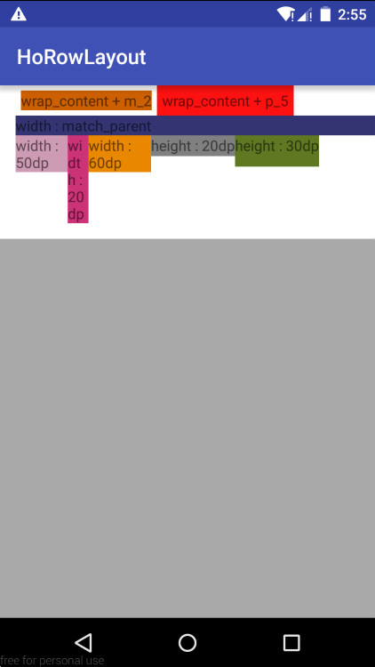

# A RowLayout Demo in Android

This Repository shows the implement of **Row-Layout**, which is also called **Flow-Layout**, in Android. Detailed comments are provided among the codes. 

## Key Features
* All views inside rowLayout viewgroup are filled in rows and automatically wrap. 

* Child view is allowed to set its own margins. 

## Main Idea

### How Android Draw Views
Drawing the layout is a two pass process: a measure pass and a layout pass. The measuring pass is implemented in ``measure(int, int)`` and is a top-down traversal of the View tree. Each View pushes dimension specifications down the tree during the recursion. At the end of the measure pass, every View has stored its measurements. The second pass happens in ``layout(int, int, int, int)`` and is also top-down. During this pass each parent is responsible for positioning all of its children using the sizes computed in the measure pass.(More refer [how-android-draws](https://developer.android.com/guide/topics/ui/how-android-draws.html))

### The Implement Steps
In general, the implement includes two main steps. Firstly, to get some feature varibles by **measuring all children**. Secondly, to **specify each view's layout position** according to the feature varibles.  

Measurement is implemented by overridding the ``onMeasure()`` method. After all the child views are measured, we can accumulate **the number of children** under the constraint width of each row, and store **each row's height** which equals to the largest height among children's. Finally, we can set **the largest width among all rows** and **the sum height of all rows** as parents' measurement size. 

Layout is implemented by overridding the ``onLayout()`` method. According to the list of the numbers of children in each row, we can layout each view into its corresponding row. 

In addition, **parent's padding** and **child views' margin** need to be considered. The padding must involve in the measurement by calling ``getPaddingLeft()``, ``getPaddingRight()`` and another two get methods. Three methods, ``generateLayoutParams(AttributeSet attrs)``, ``generateLayoutParams(LayoutParams p)``, ``generateDefaultLayoutParams()`` should be overrided in order to get child view's marginLayoutParams. Then, do not forget to add the margins which is from view's marginLayoutParams in when onlayout() is called. 

## License

Copyright (C) 2017. Henry Tam (Hosle) 

Contact: hosle@163.com

Licensed under the Apache License, Version 2.0 (the "License");
you may not use this file except in compliance with the License.
You may obtain a copy of the License at

http://www.apache.org/licenses/LICENSE-2.0

Unless required by applicable law or agreed to in writing, software distributed under the License is distributed on an "AS IS" BASIS, WITHOUT WARRANTIES OR CONDITIONS OF ANY KIND, either express or implied.
See the License for the specific language governing permissions and limitations under the License.

